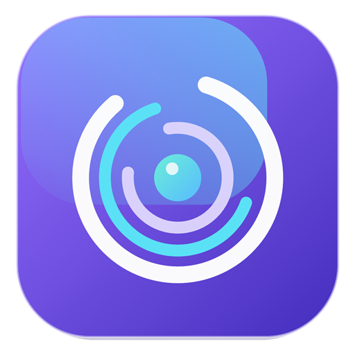

# Bowser Profile Browser



A privacy-focused Windows desktop application for creating and managing consistent, isolated browser workspaces.

Bowser Profile Browser was built for local workspace organization, authorized compatibility testing, and repeatable browser environments. Each profile keeps its own session data and stable environment settings.

## Features

- Create, edit, duplicate, search, and delete browser profiles.
- Keep cookies, cache, and local storage isolated per profile.
- Choose from 100 coherent Windows, macOS, Android, and Linux presets.
- Keep a profile's user agent and environment settings stable across launches and updates.
- Import user-agent libraries from TXT, CSV, JSON, or JSONL files.
- Configure start URL, locale, timezone, screen properties, and optional proxy settings.
- Protect proxy passwords with Electron `safeStorage` on Windows.
- Navigate with Back, Forward, Reload/Stop, Home, URL controls, and keyboard shortcuts.
- Update in place without uninstalling or deleting existing profiles.

## Download

Download the current Windows installer from [GitHub Releases](https://github.com/Ajnsnsn/bowser-profile-browser/releases/latest).

The installer is currently unsigned, so Windows SmartScreen may display an **Unknown publisher** warning.

## Development

Requirements:

- Windows 10 or 11 (64-bit)
- Node.js and npm

```powershell
npm install
npm run test:syntax
npm run test:integration
npm start
```

Create the Windows installer:

```powershell
npm run package
```

## Technology

JavaScript, Electron, Node.js, HTML, CSS, Chromium, Electron Builder, PowerShell, OpenAI Codex, and GPT-5.6.

## How Codex and GPT-5.6 were used

I used OpenAI Codex and GPT-5.6 throughout development as engineering collaborators. They helped me:

- Inspect and restructure the original codebase.
- Design the Electron profile and isolated-session architecture.
- Implement 100 coherent environment presets with stable user-agent settings.
- Diagnose profile lifecycle, form-state, and browser navigation bugs.
- Build automated syntax, integration, regression, and visual tests.
- Improve the user interface and create the application icon and project media.
- Package the Windows installer and prepare the GitHub release.

All generated changes were reviewed and verified through complete user workflows. Codex was used iteratively: I provided requirements and bug reports, inspected the results, ran tests, and refined the implementation until the application behaved consistently.

## Responsible use

This project is intended for privacy-conscious productivity and authorized browser testing. It is not intended for fraud, bypassing platform protections, or other abusive activity. Users are responsible for complying with applicable laws and website terms.

## License

Released under the [MIT License](LICENSE).
